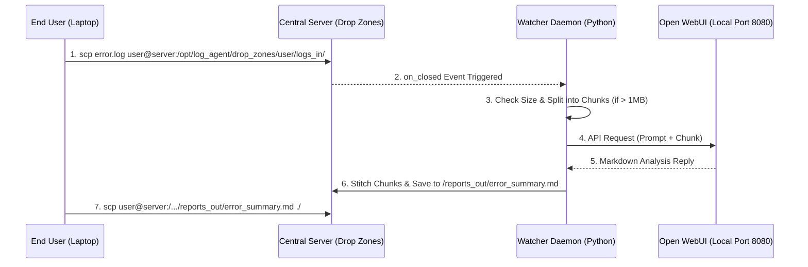

# SSH-RAG Dropbox Log Summarizer

An enterprise-grade, multi-threaded Python daemon that facilitates secure AI log summarization across a local network without requiring end-users to install or run any AI tools.

This setup leverages an **SSH/SCP Drop Zone Architecture** combined with a single centralized **Open WebUI** instance to safely process logs (including massive files via automatic chunking) while preventing GPU memory overload.

---

## 🌟 Key Benefits & Architecture

1. **Zero Setup for End-Users**: End-users do not need Python, Open WebUI, or GPU hardware. They simply securely copy (SCP) their log files into a designated network folder.
2. **Centralized AI Server**: By running a single instance of Open WebUI on the main server (port 8080), you save on GPU costs and consolidate your infrastructure.
3. **Automatic Chunking for Massive Logs**: If a user uploads a log file larger than the configured limit (default: 1MB), the daemon automatically splits the file into manageable chunks, queries the AI sequentially, and stitches the partial analysis into one unified Markdown report.
4. **Queue-Based Throttling**: If multiple users upload logs simultaneously, the daemon queues the requests to process them one at a time, ensuring the central AI model never runs out of memory (OOM).

### Workflow Diagram



---

## 🚀 Installation & Setup

### 1. Launch Central Open WebUI
Before running the daemon, ensure your Open WebUI instance is running on the host server. A launch script is provided for convenience:
```bash
python scripts/launch_open_webui.py
```
*(This ensures Open WebUI is listening on `http://localhost:8080`)*

### 2. Automated Daemon Setup
Run the setup script on your server to create the necessary directories (`/opt/log_agent`), configure the virtual environment, and set permissions:
```bash
chmod +x scripts/setup.sh
sudo ./scripts/setup.sh
```

### 3. API Token Configuration
You must configure your API tokens mapping local usernames to their respective Open WebUI keys.
```bash
sudo nano /opt/log_agent/config/user_keys.json
```
```json
{
    "alice": "sk-your-openwebui-api-key-for-alice",
    "bob": "sk-your-openwebui-api-key-for-bob"
}
```

### 4. Enable Background Service
Start the systemd service so the daemon persists across server reboots.
```bash
sudo cp systemd/log_agent.service /etc/systemd/system/
sudo systemctl daemon-reload
sudo systemctl enable --now log_agent
```

### 5. Automated Disk Cleanup (Optional but Recommended)
To prevent logs from consuming your server's disk space, add a cron job:
```bash
sudo crontab -e
```
Add this line to delete files older than 7 days every night at midnight:
```bash
0 0 * * * /opt/log_agent/scripts/cleanup_cron.sh
```

---

## 💻 How End-Users Use It

As an end-user, simply use SCP or an SFTP client to transfer files.

**1. Upload a log file:**
```bash
scp my_server_crash.log my_user@central_server_ip:/opt/log_agent/drop_zones/my_user/logs_in/
```

**2. Wait a few moments (depending on file size), then download the AI report:**
```bash
scp my_user@central_server_ip:/opt/log_agent/drop_zones/my_user/reports_out/my_server_crash_summary.md ./
```

---

## ⚙️ Environment Variables

The daemon can be customized by exporting these environment variables (can be added directly to the `systemd/log_agent.service` file):

- `LOG_AGENT_BASE_DIR` (default: `/opt/log_agent`)
- `LOG_AGENT_CONFIG_PATH` (default: `<BASE_DIR>/config/user_keys.json`)
- `LOG_AGENT_DROP_ZONES_DIR` (default: `<BASE_DIR>/drop_zones`)
- `LOG_AGENT_API_URL` (default: `http://localhost:8080/api/chat/completions`)
- `LOG_AGENT_MODEL` (default: `gemma-4`)
- `LOG_AGENT_MAX_FILE_SIZE` (default: `1048576` bytes / 1MB)

---

## 🧪 Testing

This project includes a comprehensive `pytest` suite that mocks the Open WebUI API to test chunking, structural limits, and user configurations without using real GPU compute.

```bash
python3 -m venv venv
source venv/bin/activate
pip install -r requirements.txt
PYTHONPATH=. pytest tests/
```
